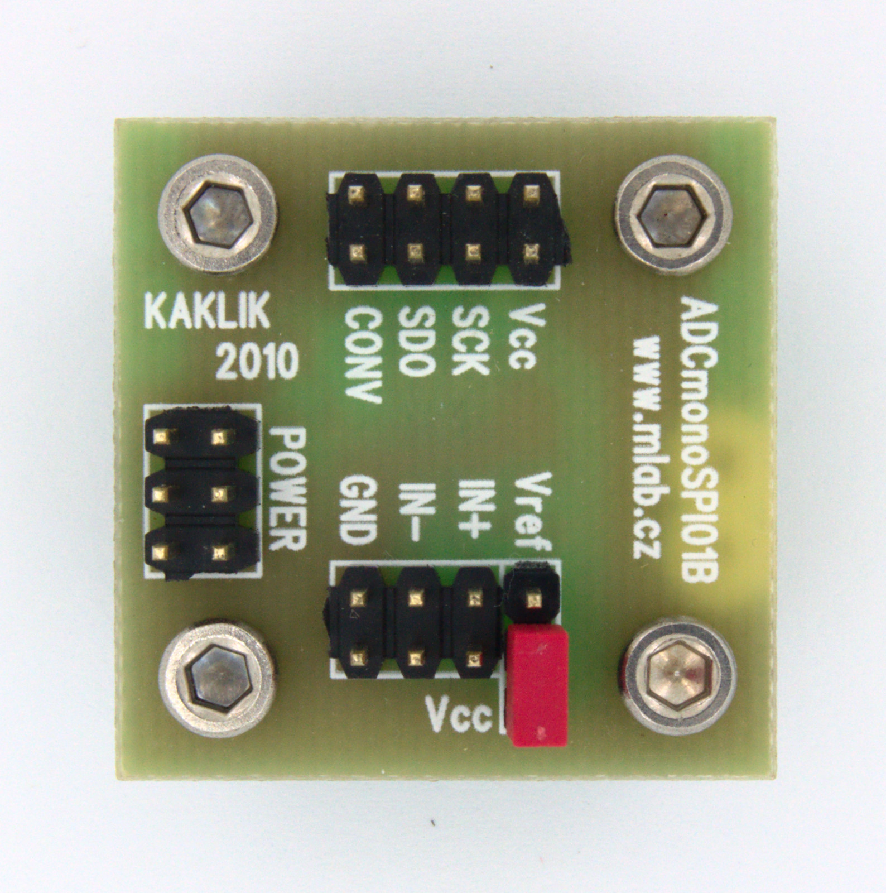

[Czech](./README.cs.md)
<!--- module --->
# ADCmonoSPI01B
<!--- Emodule --->

<!--- subtitle --->Single input ADC<!--- Esubtitle --->

<!--- description --->Mono high resolution (16bit) analog to digital converter. With serial data output.<!--- Edescription --->
            