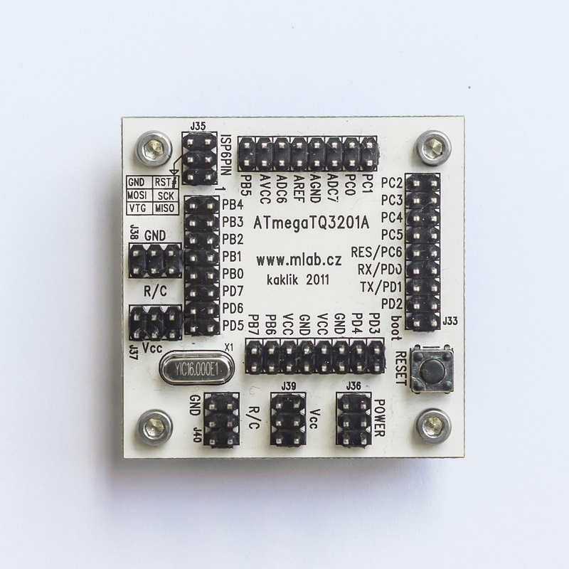

<!--- PrjInfo ---> <!--- Please remove this line after manually editing --->
<!--- 00a56be08b96043df9e37d6aff7b6990 --->
<!--- Created:20170112-18:22: ---> 
<!--- Author:Mlab: ---> 
<!--- AuthorEmail:mlab@mlab.cz: ---> 
<!--- Tags:imported: ---> 
<!--- Ust:http://www.ust.cz/shop/product_info.php?cPath=22_23&products_id=114: ---> 
<!--- Name:ATmegaTQ3201A: --->
#ATmegaTQ3201A 
<!--- LongName --->
Module for ATmega MCU in TQFP32
<!--- ELongName ---> 

<!--- Lead --->
Processor module for ATMEL ATmega in TQFP32 package.
  The module contains processor and standard crystal or clock crystal
  can be used. There is RESET push button and ATMEL ISP 6 PIN connector.
<!--- ELead ---> 

 

​
​
<!--- Description --->
<!--- EDescription --->
<!--- Content --->
<!--- EContent --->
            