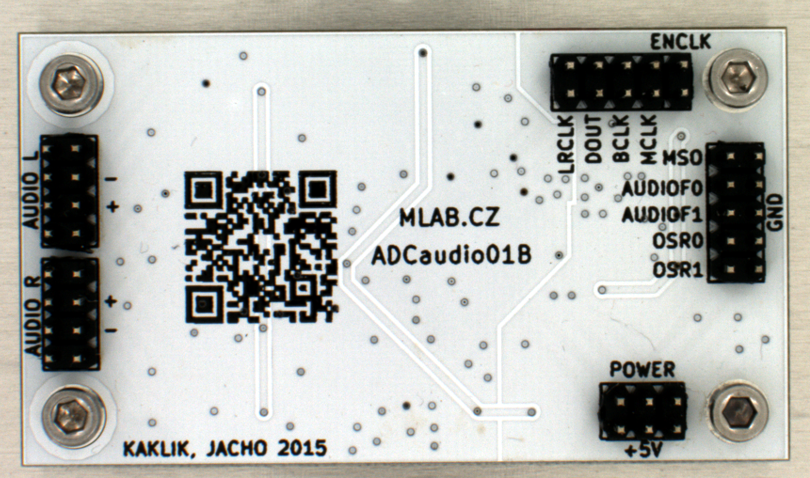

[English](./README.md)
<!--- module --->
# ADCaudio01B
<!--- Emodule --->

<!--- subtitle --->Modul audio A/D převodníku<!--- Esubtitle --->

<!--- description --->Modul slouží jako audio vstup. Digitální data jsou dostupná přes rozhraní I2S s rozlišením až 192kHz@24bit.<!--- Edescription --->
            