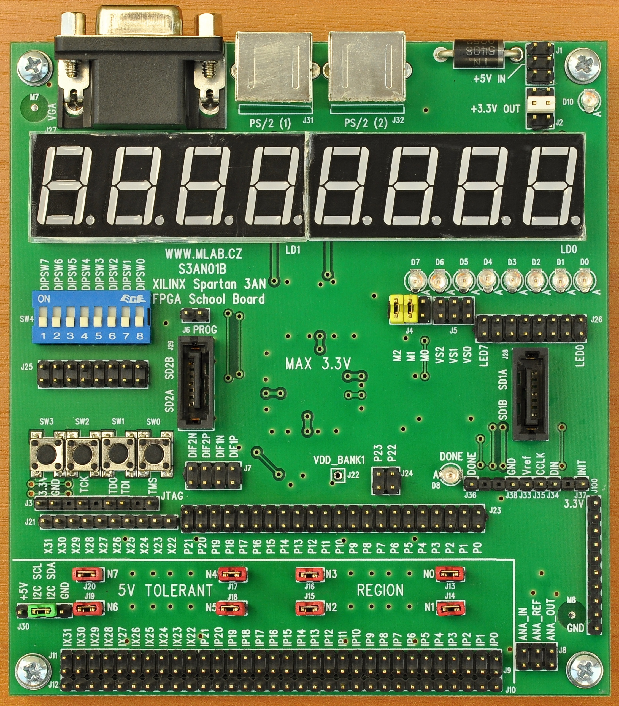

<!--- PrjInfo ---> <!--- Please remove this line after manually editing --->
<!--- 00a56be08b96043df9e37d6aff7b6990 --->
<!--- Created:2022-02-16 22:00:14.843739: ---> 
<!--- Author:: ---> 
<!--- AuthorEmail:: ---> 
<!--- Tags:: ---> 
<!--- Ust:: ---> 
<!--- Label --->
<!--- ELabel ---> 
<!--- Name:S3AN01B: --->
# S3AN01B
<!--- LongName --->
## Xilinx Spartan 3 XC3S50AN FPGA School Board
<!--- ELongName ---> 

<!--- Lead --->
The school board allows interested people to play with FPGA from XILINX. The board contains LED display, some switches and push buttons. It has VGA video port, PS/2 ports for keyboard and mouse. Because the main chip is not 5V tolerant, the board is equipped with 5V tolerant buffers (inputs). The board is powered from 5V, internal power supply is included. For timing there is one 100MHz crystal oscillator.
<!--- ELead ---> 

 

<!--- Description --->
<!--- EDescription --->
<!--- Content --->
<!--- EContent --->
 Generated with [MLABweb](https://github.com/MLAB-project/MLABweb). (2022-02-16)