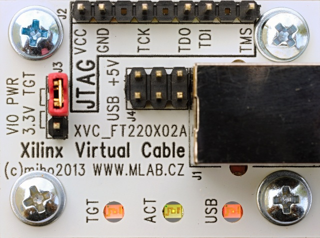

<!--- PrjInfo ---> <!--- Please remove this line after manually editing --->
<!--- 00a56be08b96043df9e37d6aff7b6990 --->
<!--- Created:2022-02-16 21:35:48.348506: ---> 
<!--- Author:: ---> 
<!--- AuthorEmail:: ---> 
<!--- Tags:: ---> 
<!--- Ust:: ---> 
<!--- Label --->
<!--- ELabel ---> 
<!--- Name:XVC_FT220X02A: --->
# XVC_FT220X02A
<!--- LongName --->
## Xilinx Virtual (JTAG) Cable with FTDI FT220X chip
<!--- ELongName ---> 

<!--- Lead --->
XVC JTAG programming cable for downloading and debug projects with XILINX FPGA/CPLD device. It is directly supported by ISE design software (and Chipscope as well). The design software sends commands across network to the computer with this cable attached to it and supporting software sends data to JTAG interface. This XVC cable is based on a cheap FTDI FT220X chip.
<!--- ELead ---> 

 

<!--- Description --->
<!--- EDescription --->
<!--- Content --->
<!--- EContent --->
 Generated with [MLABweb](https://github.com/MLAB-project/MLABweb). (2022-02-16)