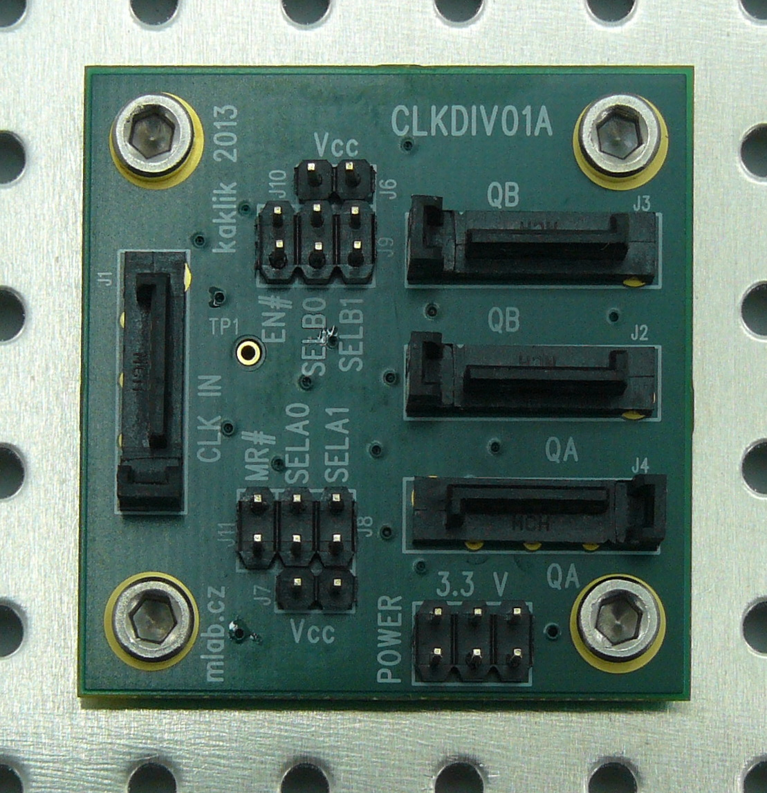

<!--- PrjInfo ---> <!--- Please remove this line after manually editing --->
<!--- 00a56be08b96043df9e37d6aff7b6990 --->
<!--- Created:20170111-16:38: ---> 
<!--- Author:Mlab: ---> 
<!--- AuthorEmail:mlab@mlab.cz: ---> 
<!--- Tags:imported: ---> 
<!--- Ust:http://www.ust.cz/shop/product_info.php?products_id=245: ---> 
<!--- Name:CLKDIV01A: --->
#CLKDIV01A 
<!--- LongName --->
Differential input Clock divider
<!--- ELongName ---> 

<!--- Lead --->
Multiple division ratios can be selected by jumpers. Possible division ratios are: (÷1, ÷2, ÷4, ÷8) or (÷2, ÷4, ÷8, ÷16) every output is synchronous each other. The common enable (EN) is synchronous so that the internal dividers will only be enabled/disabled when the internal clock is already in the LOW state.
<!--- ELead ---> 

 

​
​
<!--- Description --->
<!--- EDescription --->
<!--- Content --->
<!--- EContent --->
            