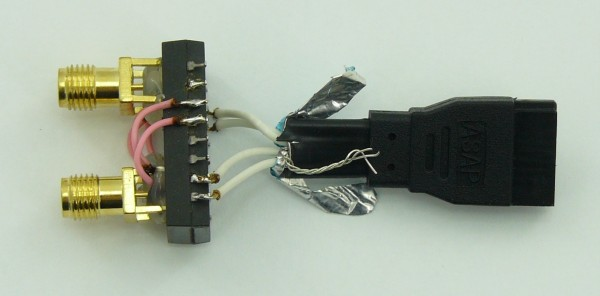

<!--- PrjInfo ---> <!--- Please remove this line after manually editing --->
<!--- 00a56be08b96043df9e37d6aff7b6990 --->
<!--- Created:20170112-18:22: ---> 
<!--- Author:Mlab: ---> 
<!--- AuthorEmail:mlab@mlab.cz: ---> 
<!--- Tags:imported: ---> 
<!--- Ust:None: ---> 
<!--- Name:SMA2SATA01A: --->
#SMA2SATA01A 
<!--- LongName --->
SATA to RF SMA coaxial cable converter
<!--- ELongName ---> 

<!--- Lead --->
Converter from asymetric coaxial cable with SMA connector to  cables with SATA connectors. Converter is based on Ethernet signal transformer. Construction of converter is bidirectional and allows balance to unbalance connections (balun).
<!--- ELead ---> 

 

​
​
<!--- Description --->
<!--- EDescription --->
<!--- Content --->
<!--- EContent --->
            