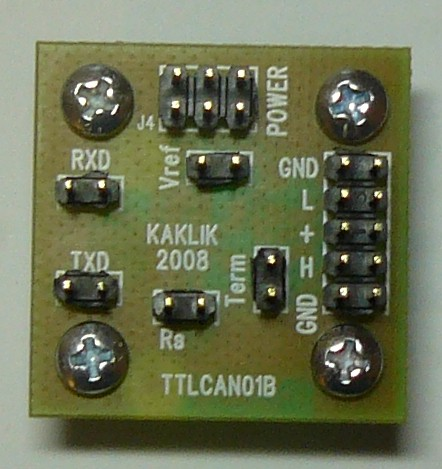

<!--- PrjInfo ---> <!--- Please remove this line after manually editing --->
<!--- 00a56be08b96043df9e37d6aff7b6990 --->
<!--- Created:20170111-16:38: ---> 
<!--- Author:Mlab: ---> 
<!--- AuthorEmail:mlab@mlab.cz: ---> 
<!--- Tags:imported: ---> 
<!--- Ust:http://www.ust.cz/shop/product_info.php?cPath=22_27&products_id=40: ---> 
<!--- Name:TTLCAN01B: --->
#TTLCAN01B 
<!--- LongName --->
TTL to CAN bus Converter
<!--- ELongName ---> 

<!--- Lead --->
The module allow conecting uprocessors to CAN bus
<!--- ELead ---> 

 

​
​
<!--- Description --->
<!--- EDescription --->
<!--- Content --->
<!--- EContent --->
            