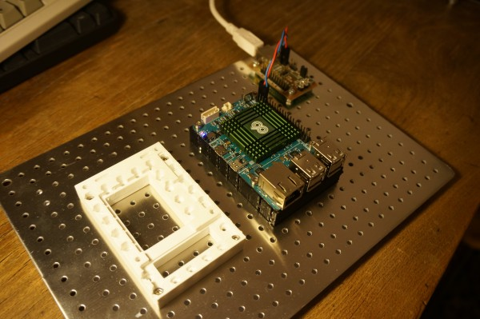

<!--- PrjInfo ---> <!--- Please remove this line after manually editing --->
<!--- 00a56be08b96043df9e37d6aff7b6990 --->
<!--- Created:: ---> 
<!--- Author:: ---> 
<!--- AuthorEmail:: ---> 
<!--- Tags:: ---> 
<!--- Ust:: ---> 
<!--- Label --->
<!--- ELabel ---> 
<!--- Name:ODROID-C1: --->
# ODROID-C1
<!--- LongName --->
## Four core ARM computer module
<!--- ELongName ---> 

<!--- Lead --->
Computer module for applications which needs full Linux operating system and lot of computing power. It is suitable for machine control or home automation as example.
<!--- ELead ---> 

 

<!--- Description --->
<!--- EDescription --->
<!--- Content --->
<!--- EContent --->
