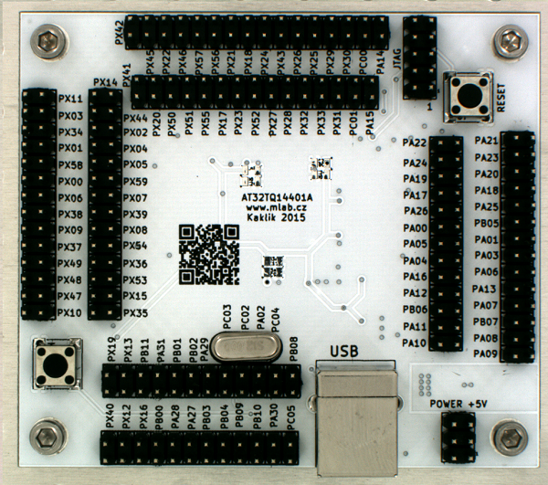

<!--- PrjInfo ---> <!--- Please remove this line after manually editing --->
<!--- 00a56be08b96043df9e37d6aff7b6990 --->
<!--- Created:2019-01-10 00:40:09.126885: ---> 
<!--- Author:: ---> 
<!--- AuthorEmail:: ---> 
<!--- Tags:: ---> 
<!--- Ust:: ---> 
<!--- Label --->
<!--- ELabel ---> 
<!--- Name:AT32TQ14401A: --->
# AT32TQ14401A
<!--- LongName --->
## AVR32 MCU module
<!--- ELongName ---> 

<!--- Lead --->
Module is intended for development of applications based on powerful 32bit Atmel microcontrolers with AVR32 core AT32UC3A series.
<!--- ELead ---> 

 

<!--- Description --->
<!--- EDescription --->
<!--- Content --->
<!--- EContent --->
 Generated with [MLABweb](https://github.com/MLAB-project/MLABweb). (2019-01-10)