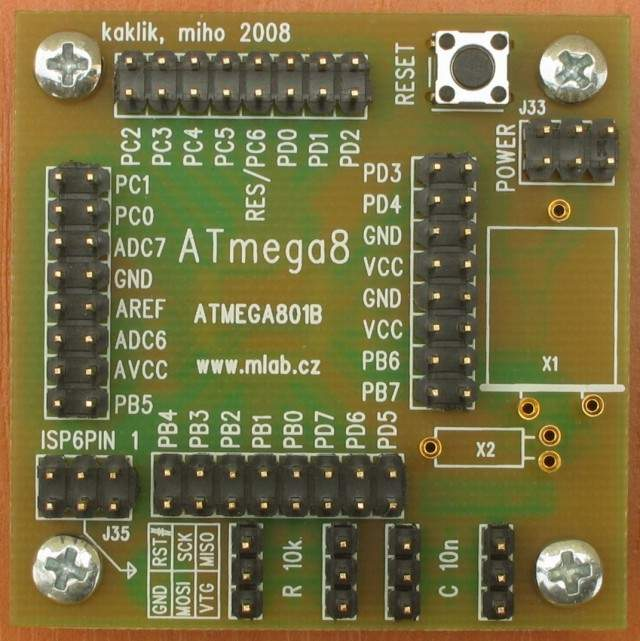

<!--- PrjInfo ---> <!--- Please remove this line after manually editing --->
<!--- 00a56be08b96043df9e37d6aff7b6990 --->
<!--- Created:2022-02-16 21:54:20.425262: ---> 
<!--- Author:: ---> 
<!--- AuthorEmail:: ---> 
<!--- Tags:: ---> 
<!--- Ust:: ---> 
<!--- Label --->
<!--- ELabel ---> 
<!--- Name:ATmega801B: --->
# ATmega801B
<!--- LongName --->
## Module for ATmega8 in TQFP32
<!--- ELongName ---> 

<!--- Lead --->
Processor module for ATMEL ATmega8 in TQFP32 package. The module contains processor and standard crystal or clock crystal can be used. There is RESET push button and ATMEL ISP 6 PIN connector.
<!--- ELead ---> 

 

<!--- Description --->
<!--- EDescription --->
<!--- Content --->
<!--- EContent --->
 Generated with [MLABweb](https://github.com/MLAB-project/MLABweb). (2022-02-16)