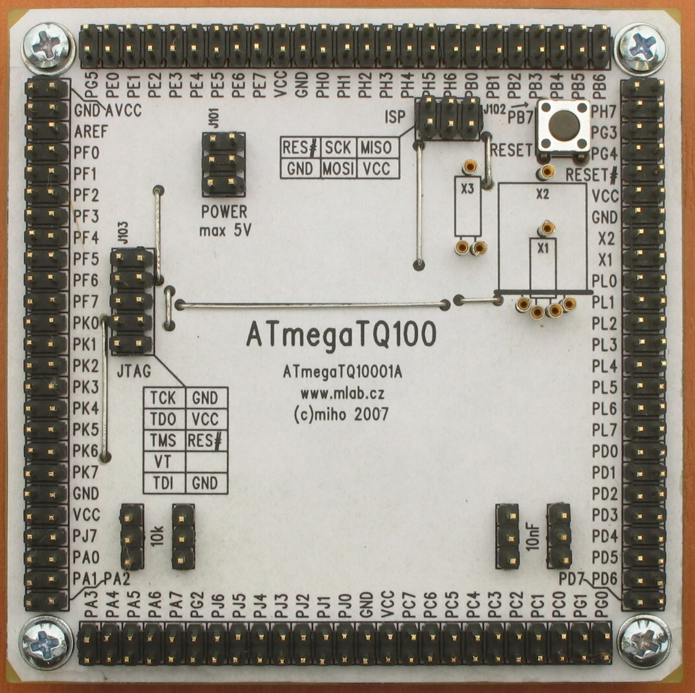

<!--- PrjInfo ---> <!--- Please remove this line after manually editing --->
<!--- 00a56be08b96043df9e37d6aff7b6990 --->
<!--- Created:2022-02-16 21:54:55.895820: ---> 
<!--- Author:: ---> 
<!--- AuthorEmail:: ---> 
<!--- Tags:: ---> 
<!--- Ust:: ---> 
<!--- Label --->
<!--- ELabel ---> 
<!--- Name:ATmegaTQ10001A: --->
# ATmegaTQ10001A
<!--- LongName --->
## Module for ATmega in TQFP100 package
<!--- ELongName ---> 

<!--- Lead --->
Processor module for ATMEL ATmega in TQFP100 package. The module can use standard and/or clock crystals. It is equipped with RESET push button and programming connector for ISP (6PIN) and JTAG (10PIN) programming.
<!--- ELead ---> 

 

<!--- Description --->
<!--- EDescription --->
<!--- Content --->
<!--- EContent --->
 Generated with [MLABweb](https://github.com/MLAB-project/MLABweb). (2022-02-16)