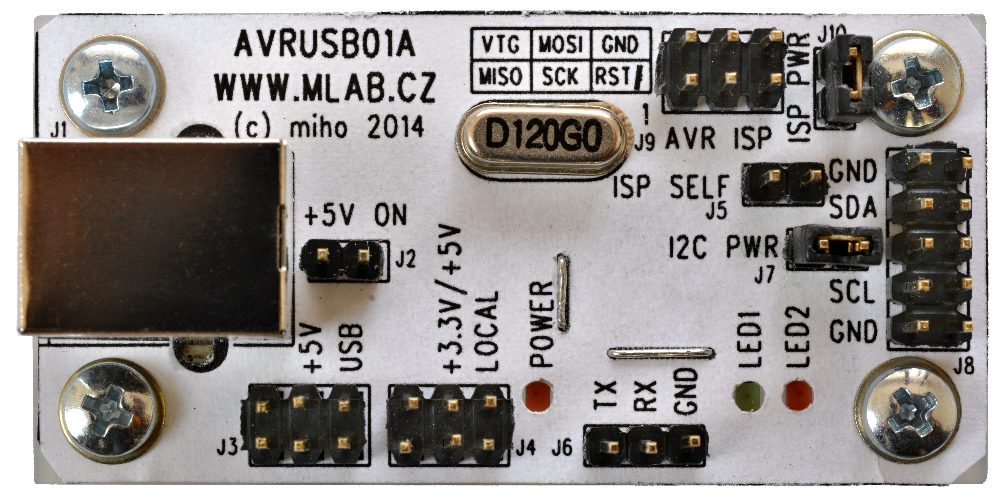

<!--- PrjInfo ---> <!--- Please remove this line after manually editing --->
<!--- 00a56be08b96043df9e37d6aff7b6990 --->
<!--- Created:2022-02-16 21:53:34.924551: ---> 
<!--- Author:: ---> 
<!--- AuthorEmail:: ---> 
<!--- Tags:: ---> 
<!--- Ust:: ---> 
<!--- Label --->
<!--- ELabel ---> 
<!--- Name:AVRUSB01A: --->
# AVRUSB01A
<!--- LongName --->
## USB module for AVR processors
<!--- ELongName ---> 

<!--- Lead --->
Processor module for AVR software version of (Low Speed) USB. May be used as ISP AVR programmer (with USBasp firmware), or USB to I2C convertor (with i2c-tiny-usb firmware). Uses ATmega88 in TQFP32 package.
<!--- ELead ---> 

 

<!--- Description --->
<!--- EDescription --->
<!--- Content --->
<!--- EContent --->
 Generated with [MLABweb](https://github.com/MLAB-project/MLABweb). (2022-02-16)