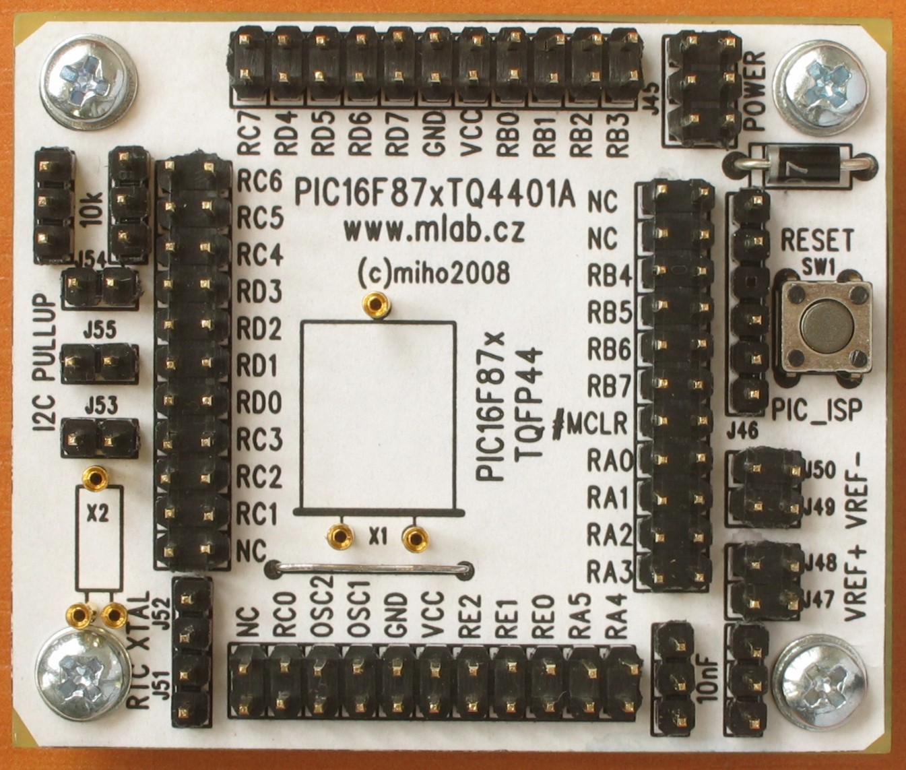

<!--- PrjInfo ---> <!--- Please remove this line after manually editing --->
<!--- 00a56be08b96043df9e37d6aff7b6990 --->
<!--- Created:2022-02-16 21:48:46.803730: ---> 
<!--- Author:: ---> 
<!--- AuthorEmail:: ---> 
<!--- Tags:: ---> 
<!--- Ust:: ---> 
<!--- Label --->
<!--- ELabel ---> 
<!--- Name:PIC16F87xTQ4401A: --->
# PIC16F87xTQ4401A
<!--- LongName --->
## Module for PIC16F87x in TQFP44 package
<!--- ELongName ---> 

<!--- Lead --->
The processor module for MICROCHIP PIC16F87x in TQFP44 package consists of processor, headers, programming header and RESET push button.
<!--- ELead ---> 

 

<!--- Description --->
<!--- EDescription --->
<!--- Content --->
<!--- EContent --->
 Generated with [MLABweb](https://github.com/MLAB-project/MLABweb). (2022-02-16)