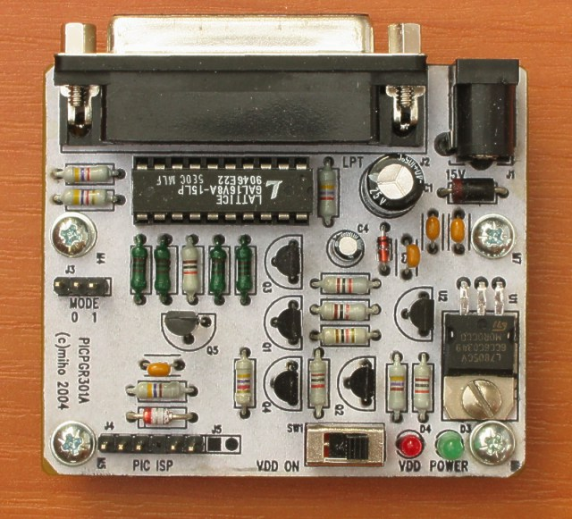

<!--- PrjInfo ---> <!--- Please remove this line after manually editing --->
<!--- 00a56be08b96043df9e37d6aff7b6990 --->
<!--- Created:2022-02-16 21:51:46.428056: ---> 
<!--- Author:: ---> 
<!--- AuthorEmail:: ---> 
<!--- Tags:: ---> 
<!--- Ust:: ---> 
<!--- Label --->
<!--- ELabel ---> 
<!--- Name:PICPGR301A: --->
# PICPGR301A
<!--- LongName --->
## Small development programmer for PIC processors
<!--- ELongName ---> 

<!--- Lead --->
The programmer uses LPT port of PC and contains 5V voltage regulator so it can be used for powering target application. The programmer has tree state outputs and that is why it is not necessary to disconnect it from target application while debugging.
<!--- ELead ---> 

 

<!--- Description --->
<!--- EDescription --->
<!--- Content --->
<!--- EContent --->
 Generated with [MLABweb](https://github.com/MLAB-project/MLABweb). (2022-02-16)