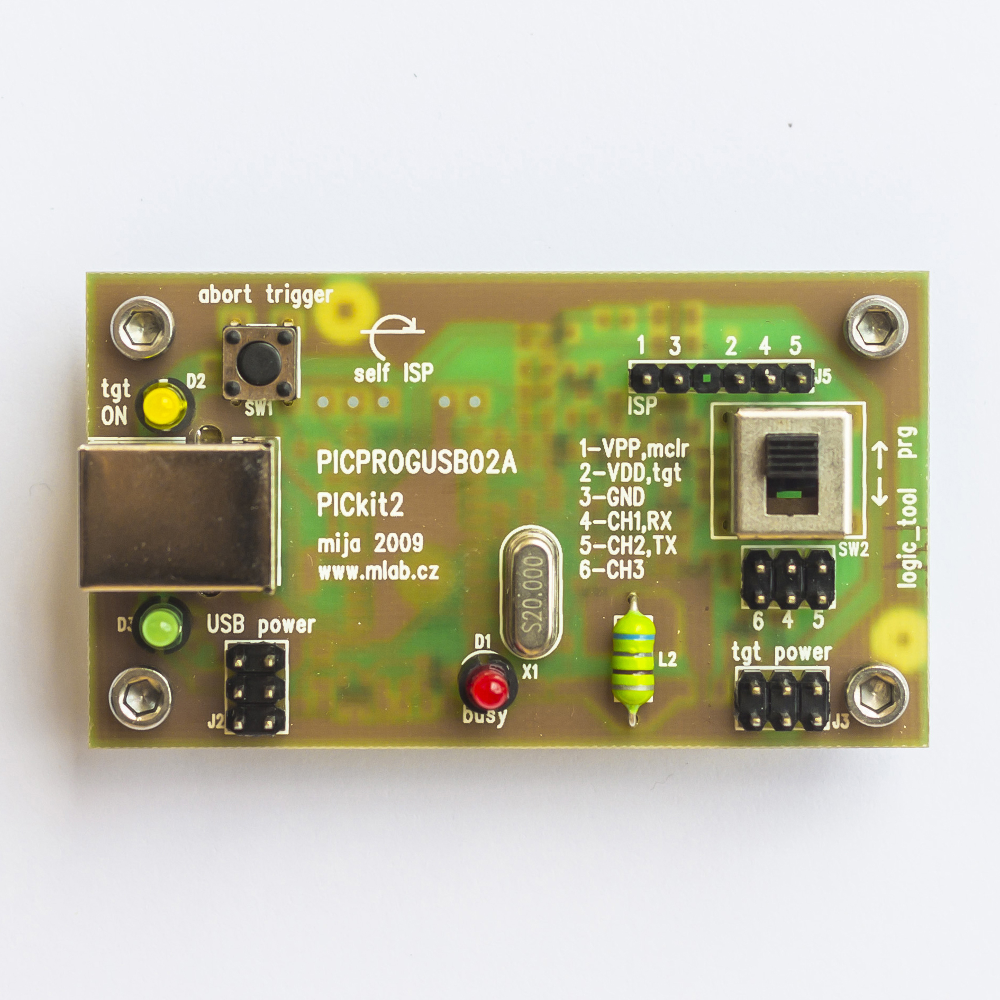

<!--- PrjInfo ---> <!--- Please remove this line after manually editing --->
<!--- 00a56be08b96043df9e37d6aff7b6990 --->
<!--- Created:2022-02-16 21:31:07.345628: ---> 
<!--- Author:: ---> 
<!--- AuthorEmail:: ---> 
<!--- Tags:: ---> 
<!--- Ust:: ---> 
<!--- Label --->
<!--- ELabel ---> 
<!--- Name:PICPROGUSB02A: --->
# PICPROGUSB02A
<!--- LongName --->
## USB development programmer for PIC processors
<!--- ELongName ---> 

<!--- Lead --->
The programmer is compatible with PicKit 2 design of Microchip. The programmer uses USB port. The programmer has tree state outputs and that is why it is not necessary to disconnect it from target application while debugging. A special feature of this programes is logic analyzer.
<!--- ELead ---> 

 

<!--- Description --->
<!--- EDescription --->
<!--- Content --->
<!--- EContent --->
 Generated with [MLABweb](https://github.com/MLAB-project/MLABweb). (2022-02-16)