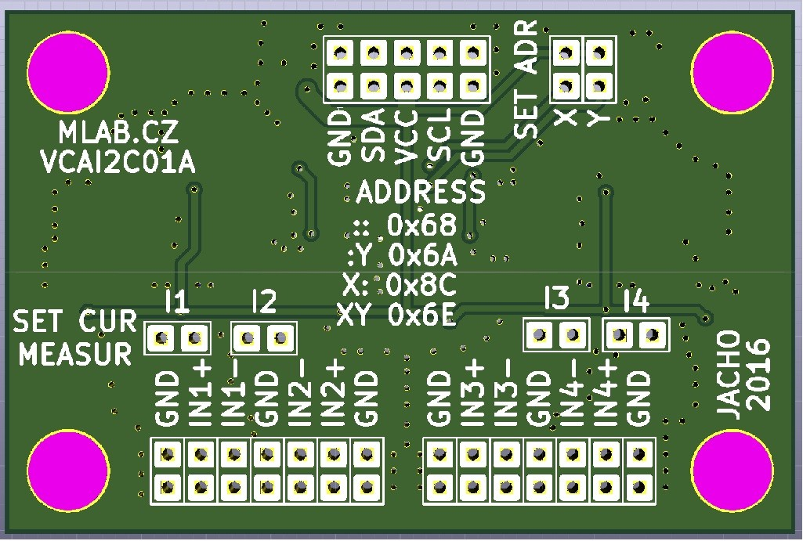

<!--- PrjInfo ---> <!--- Please remove this line after manually editing --->
<!--- 00a56be08b96043df9e37d6aff7b6990 --->
<!--- Created:20170112-18:22: ---> 
<!--- Author:Mlab: ---> 
<!--- AuthorEmail:mlab@mlab.cz: ---> 
<!--- Tags:imported: ---> 
<!--- Ust:[End]: ---> 
<!--- Name:VCAI2C01A: --->
#VCAI2C01A 
<!--- LongName --->

<!--- ELongName ---> 

<!--- Lead --->
4-channel 18-bit AD converter voltage and current for industrial sensors. Ranges: 0-5V, 0-10V, 0-20mA, 4-20mA, 0-40 mA.
<!--- ELead ---> 

 

​
​
<!--- Description --->
<!--- EDescription --->
<!--- Content --->
<!--- EContent --->
            