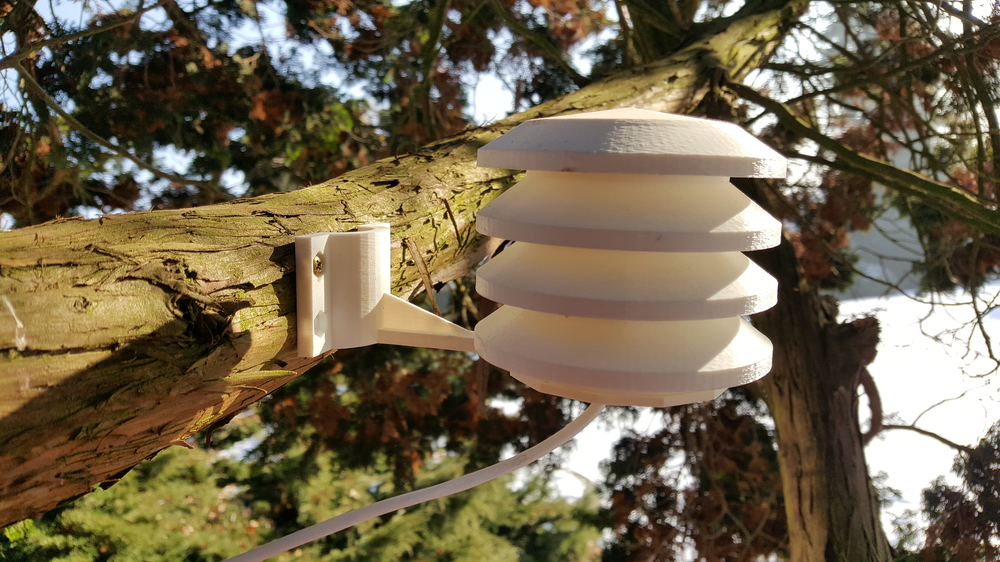
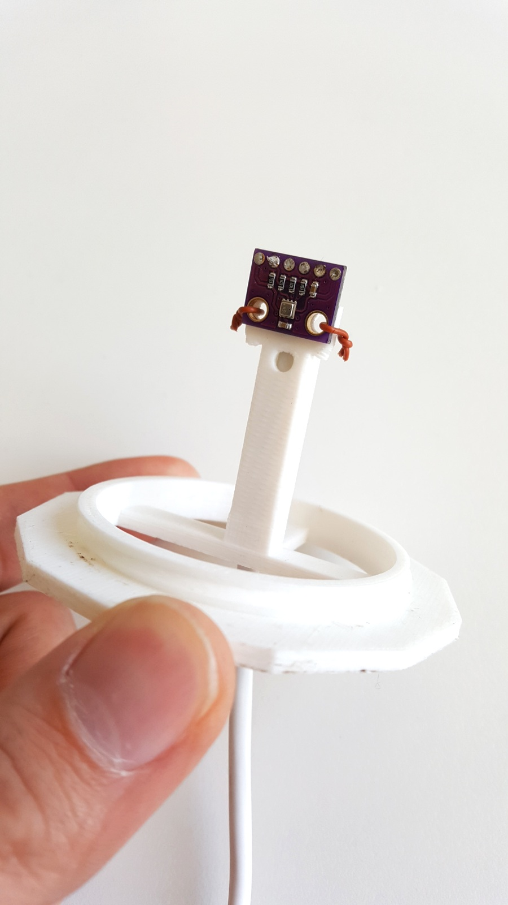
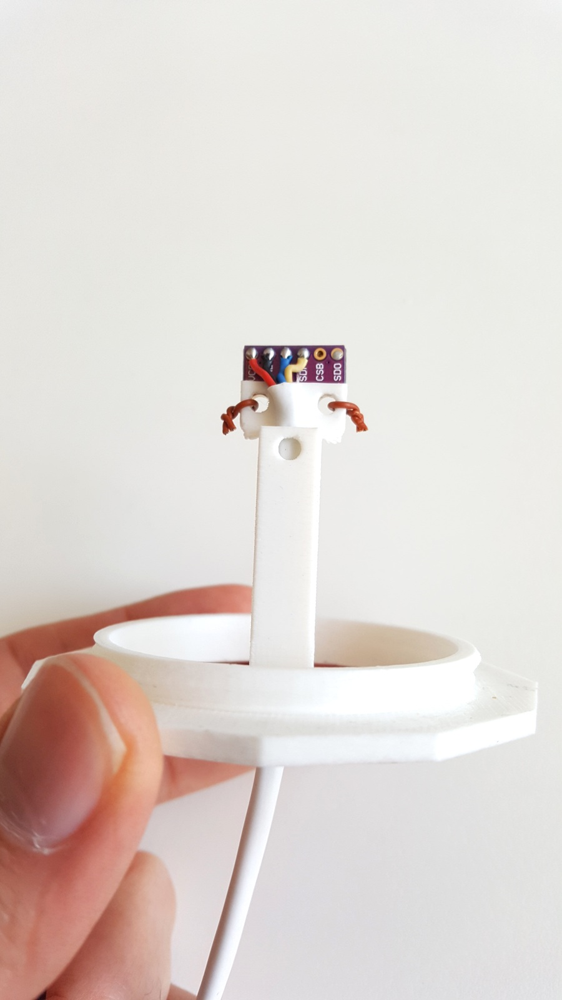

<!--- PrjInfo ---> <!--- Please remove this line after manually editing --->
<!--- 00a56be08b96043df9e37d6aff7b6990 --->
<!--- Created:20170112-18:22: ---> 
<!--- Author:Mlab: ---> 
<!--- AuthorEmail:mlab@mlab.cz: ---> 
<!--- Tags:imported: ---> 
<!--- Ust:None: ---> 
<!--- Name:AWSCREEN01A: --->
#AWSCREEN01A 
<!--- LongName --->
Screen
<!--- ELongName ---> 

<!--- Lead --->
Radiation Shield printable 3D printer. Designed for sensor Bosh BME280. Holes fits for this module:

https://www.aliexpress.com/item/1PCS-GY-BME280-3-3-precision-altimeter-atmospheric-pressure-BME280-sensor-module/32767969468.html?spm=2114.13010608.0.0.g0sPj1

and cable LIYY 4x0,19:
https://www.gme.cz/liyy-4x0-19-bal

<!--- ELead ---> 

 
 
 

​
​
<!--- Description --->
<!--- EDescription --->
<!--- Content --->
<!--- EContent --->
            