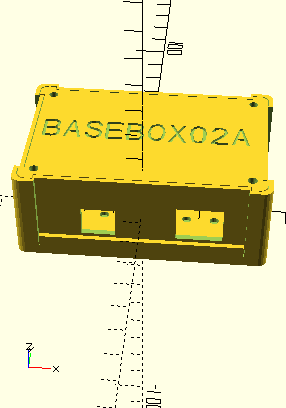

<!--- PrjInfo ---> <!--- Please remove this line after manually editing --->
<!--- 00a56be08b96043df9e37d6aff7b6990 --->
<!--- Created:20170112-18:22: ---> 
<!--- Author:Mlab: ---> 
<!--- AuthorEmail:mlab@mlab.cz: ---> 
<!--- Tags:imported: ---> 
<!--- Ust:None: ---> 
<!--- Name:BASEBOX02A: --->
#BASEBOX02A 
<!--- LongName --->
3D printable device housing box
<!--- ELongName ---> 

<!--- Lead --->
The printed plastic parts are sandwiched between standard hole-grid plates which makes the enclosure very rigid. The box sides can be easily customized for individual project needs, or separately exchanged during an instrument development.
<!--- ELead ---> 

 

​
​
<!--- Description --->
<!--- EDescription --->
<!--- Content --->
<!--- EContent --->
            