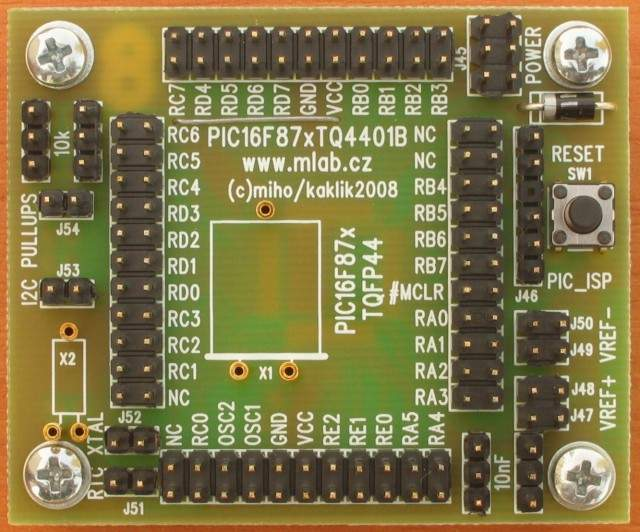

<!--- PrjInfo ---> <!--- Please remove this line after manually editing --->
<!--- 00a56be08b96043df9e37d6aff7b6990 --->
<!--- Created:20170112-18:22: ---> 
<!--- Author:Mlab: ---> 
<!--- AuthorEmail:mlab@mlab.cz: ---> 
<!--- Tags:imported: ---> 
<!--- Ust:http://www.ust.cz/shop/product_info.php?cPath=22_25&products_id=35: ---> 
<!--- Name:PIC16F87xTQ4401B: --->
#PIC16F87xTQ4401B 
<!--- LongName --->
Module for PIC16F87x in TQFP44 package
<!--- ELongName ---> 

<!--- Lead --->
The processor module for MICROCHIP PIC16F87x in TQFP44 package consists of 
  processor, headers, programming header and RESET push button.
<!--- ELead ---> 

 

​
​
<!--- Description --->
<!--- EDescription --->
<!--- Content --->
<!--- EContent --->
            