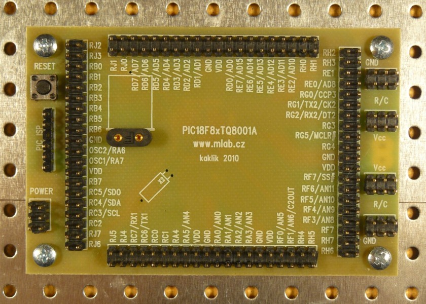

<!--- PrjInfo ---> <!--- Please remove this line after manually editing --->
<!--- 00a56be08b96043df9e37d6aff7b6990 --->
<!--- Created:20170112-18:22: ---> 
<!--- Author:Mlab: ---> 
<!--- AuthorEmail:mlab@mlab.cz: ---> 
<!--- Tags:imported: ---> 
<!--- Ust:http://www.ust.cz/shop/product_info.php?cPath=22_25&products_id=79: ---> 
<!--- Name:PIC18F8xTQ8001A: --->
#PIC18F8xTQ8001A 
<!--- LongName --->
module for PIC microprocesor
<!--- ELongName ---> 

<!--- Lead --->
Module for work with PIC18F MCU in TQFP80 package. On PCB is a bias resistor for Ethernet peripheral.
<!--- ELead ---> 

 

​
​
<!--- Description --->
<!--- EDescription --->
<!--- Content --->
<!--- EContent --->
            