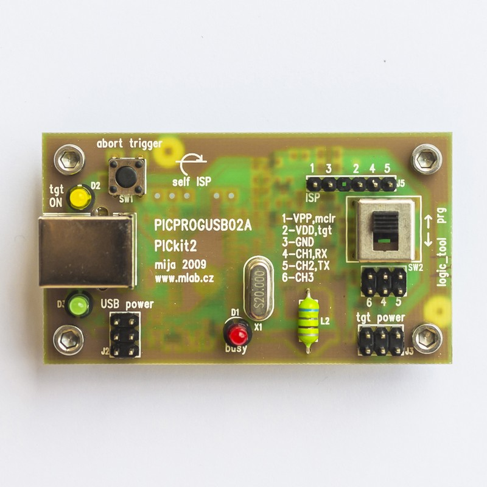

<!--- PrjInfo ---> <!--- Please remove this line after manually editing --->
<!--- 00a56be08b96043df9e37d6aff7b6990 --->
<!--- Created:20170112-18:22: ---> 
<!--- Author:Mlab: ---> 
<!--- AuthorEmail:mlab@mlab.cz: ---> 
<!--- Tags:imported: ---> 
<!--- Ust:http://www.ust.cz/shop/product_info.php?cPath=22_25&products_id=37: ---> 
<!--- Name:PICPROGUSB02A: --->
#PICPROGUSB02A 
<!--- LongName --->
USB development programmer for PIC processors
<!--- ELongName ---> 

<!--- Lead --->
The programmer is compatible with PicKit 2 design of Microchip. The programmer uses USB port. The programmer has tree state outputs and that is why it is 
  not necessary to disconnect it from target application while debugging. A special feature of this programes is logic analyzer.
<!--- ELead ---> 

 

​
​
<!--- Description --->
<!--- EDescription --->
<!--- Content --->
<!--- EContent --->
            