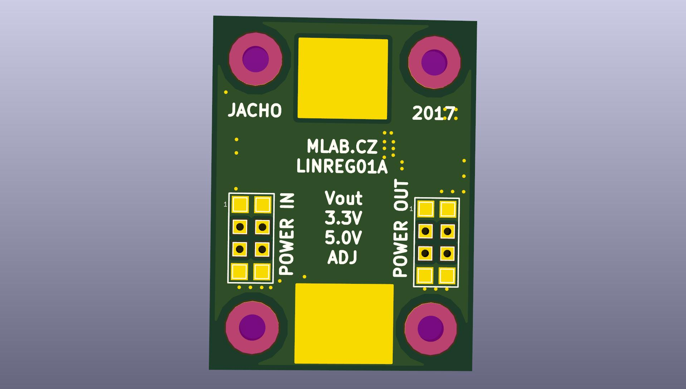

<!--- PrjInfo ---> <!--- Please remove this line after manually editing --->
<!--- 00a56be08b96043df9e37d6aff7b6990 --->
<!--- Created:20170112-18:22: ---> 
<!--- Author:Mlab: ---> 
<!--- AuthorEmail:mlab@mlab.cz: ---> 
<!--- Tags:imported: ---> 
<!--- Ust:[End]: ---> 
<!--- Name:LINREG01A: --->
#LINREG01A
<!--- LongName --->
Universal module for linear regulators
<!--- ELongName ---> 

<!--- Lead --->
The module can be fitted in housings linear stabilizers D2PAK (TO263), SOT223, DPAK (252).
<!--- ELead ---> 

 

​
​
<!--- Description --->
<!--- EDescription --->
<!--- Content --->
<!--- EContent --->
            