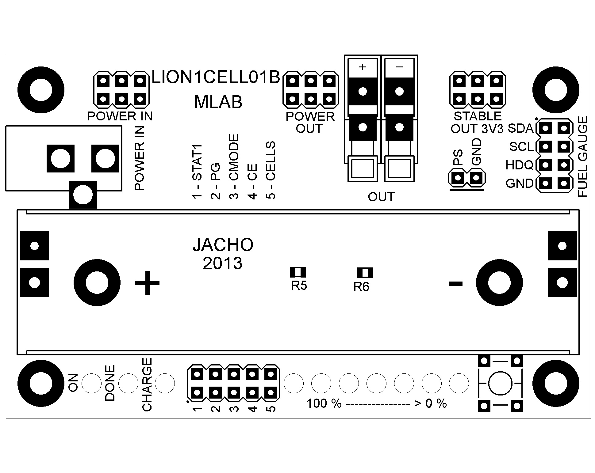

<!--- PrjInfo ---> <!--- Please remove this line after manually editing --->
<!--- 00a56be08b96043df9e37d6aff7b6990 --->
<!--- Created:20170112-18:22: ---> 
<!--- Author:Mlab: ---> 
<!--- AuthorEmail:mlab@mlab.cz: ---> 
<!--- Tags:imported: ---> 
<!--- Ust:http://www.ust.cz/shop/product_info.php?products_id=232&language=en&osCsid=nd8783lqmlq7t98fbhdjvv8vv2: ---> 
<!--- Name:LION1CELL01B: --->
#LION1CELL01B 
<!--- LongName --->
Li-ion battery management module
<!--- ELongName ---> 

<!--- Lead --->
Integrated battery management solution for 18650 li-ion batteries. It can measure remaining energy in battery, perform charging cycle from external power source and protect batteries against over voltage or over draining conditions.
<!--- ELead ---> 

 

​
​
<!--- Description --->
<!--- EDescription --->
<!--- Content --->
<!--- EContent --->
            