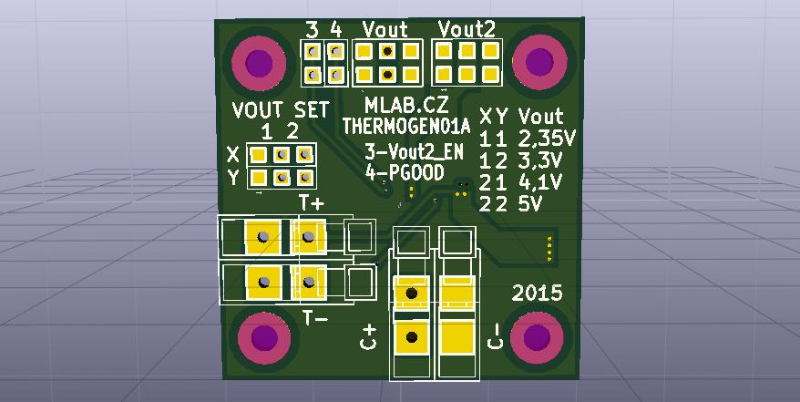

<!--- PrjInfo ---> <!--- Please remove this line after manually editing --->
<!--- 00a56be08b96043df9e37d6aff7b6990 --->
<!--- Created:20170112-18:22: ---> 
<!--- Author:Mlab: ---> 
<!--- AuthorEmail:mlab@mlab.cz: ---> 
<!--- Tags:imported: ---> 
<!--- Ust:None: ---> 
<!--- Name:THERMOGEN01A: --->
#THERMOGEN01A 
<!--- LongName --->
Thermoelectric power supply
<!--- ELongName ---> 

<!--- Lead --->
Thermoelectric generator power supply designed to use in low power typically wireless devices which should work for longtime without batteries.
<!--- ELead ---> 

 

​
​
<!--- Description --->
<!--- EDescription --->
<!--- Content --->
<!--- EContent --->
            