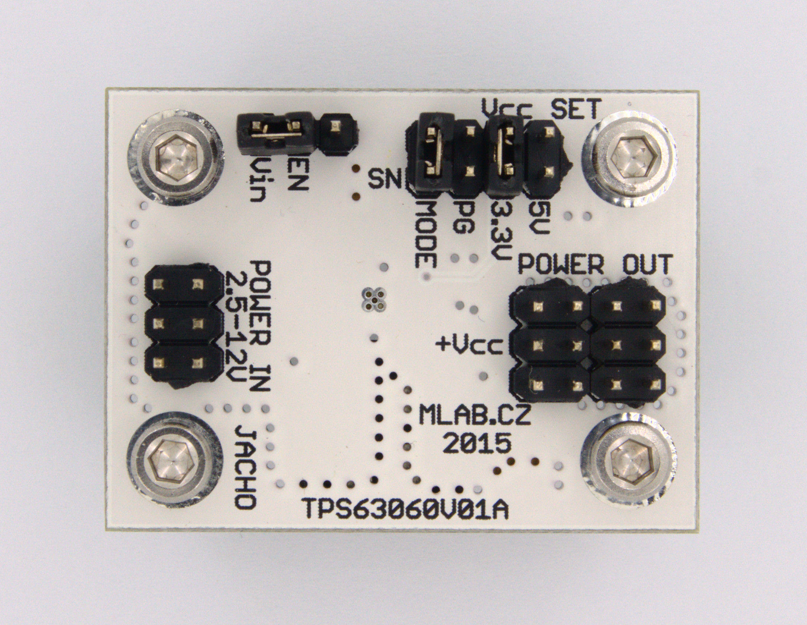

<!--- PrjInfo ---> <!--- Please remove this line after manually editing --->
<!--- 00a56be08b96043df9e37d6aff7b6990 --->
<!--- Created:20170112-18:22: ---> 
<!--- Author:Mlab: ---> 
<!--- AuthorEmail:mlab@mlab.cz: ---> 
<!--- Tags:imported: ---> 
<!--- Ust:http://www.ust.cz/shop/product_info.php?cPath=22_35&products_id=258: ---> 
<!--- Name:TPS63060V01A: --->
#TPS63060V01A 
<!--- LongName --->
BUCK-BOOST CONVERTER
<!--- ELongName ---> 

<!--- Lead --->
The drive uses the TPS63060 circuit. The input voltage range of 2.5 V - 12V. The output voltage of 3.3 V, 5 V.
<!--- ELead ---> 

 

​
​
<!--- Description --->
<!--- EDescription --->
<!--- Content --->
<!--- EContent --->
            