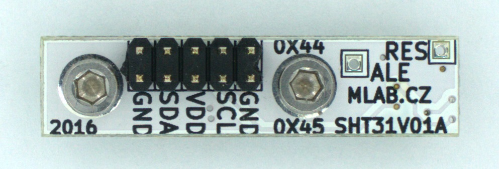

[Czech](./README.cs.md)
<!--- module --->
# SHT31V01A
<!--- Emodule --->

<!--- subtitle --->Digital relative humidity and temperature sensor<!--- Esubtitle --->

<!--- description --->SHT31 sensor module which measures relative humidity from 0% to 100% with an accuracy of + / - 2%. Temperature is measured in the range -40 ° C to 125 ° C with a an accuracy of 0.3 ° C.<!--- Edescription --->
            