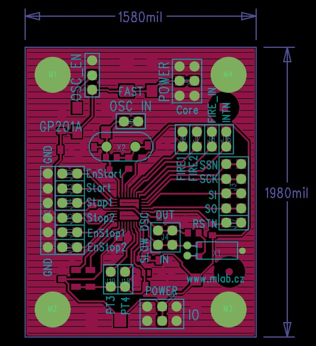

<!--- PrjInfo ---> <!--- Please remove this line after manually editing --->
<!--- 00a56be08b96043df9e37d6aff7b6990 --->
<!--- Created:2022-02-16 21:48:04.529836: ---> 
<!--- Author:: ---> 
<!--- AuthorEmail:: ---> 
<!--- Tags:: ---> 
<!--- Ust:: ---> 
<!--- Label --->
<!--- ELabel ---> 
<!--- Name:GP201A: --->
# GP201A
<!--- LongName --->
## Basic Time to Digital converter
<!--- ELongName ---> 

<!--- Lead --->
Measure time intervals up to 4us with precision 65ps. Also is capable for measure temperature (with 16bit resolution) if module is connected to temperature sensor such as PT1000.
<!--- ELead ---> 

 

<!--- Description --->
<!--- EDescription --->
<!--- Content --->
<!--- EContent --->
 Generated with [MLABweb](https://github.com/MLAB-project/MLABweb). (2022-02-16)