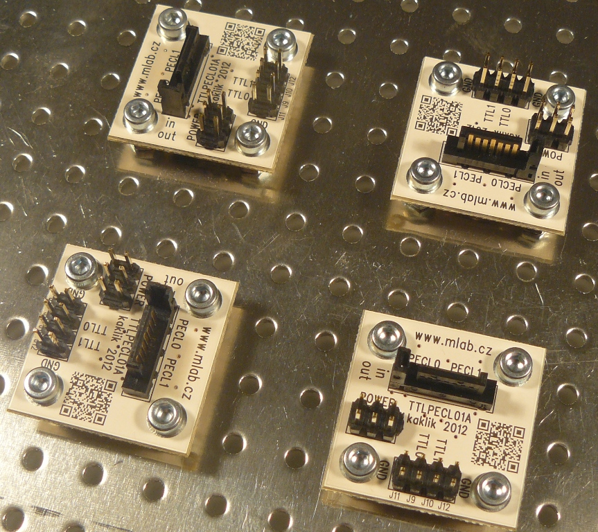

<!--- PrjInfo ---> <!--- Please remove this line after manually editing --->
<!--- 00a56be08b96043df9e37d6aff7b6990 --->
<!--- Created:20170112-18:22: ---> 
<!--- Author:Mlab: ---> 
<!--- AuthorEmail:mlab@mlab.cz: ---> 
<!--- Tags:imported: ---> 
<!--- Ust:http://www.ust.cz/shop/product_info.php?products_id=241: ---> 
<!--- Name:TTLPECL01A: --->
#TTLPECL01A 
<!--- LongName --->
TTL to PECL (PECL to TTL) Translator
<!--- ELongName ---> 

<!--- Lead --->
Translate between TTL a differential PECL logic levels direction of translation can be chosen by type of mounted chip.
<!--- ELead ---> 

 

​
​
<!--- Description --->
<!--- EDescription --->
<!--- Content --->
<!--- EContent --->
            