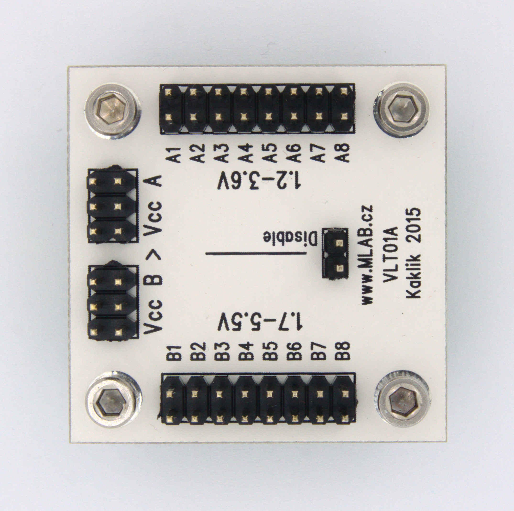

[Czech](./README.cs.md)
<!--- module --->
# VLT01A
<!--- Emodule --->

<!--- subtitle --->Voltage Level Translator<!--- Esubtitle --->

<!--- description --->Convert digital signals between two voltage levels. <!--- Edescription --->
            