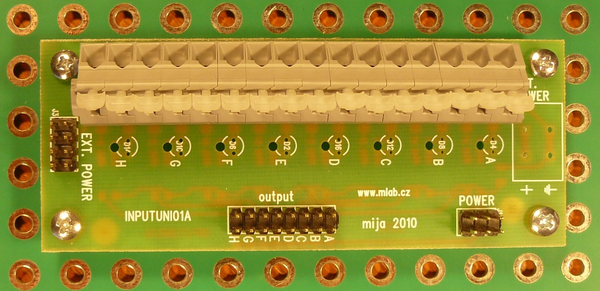

[English](./README.md)
<!--- module --->
# INPUTUNI01A
<!--- Emodule --->

<!--- subtitle --->Univerzalní 8mi vstup<!--- Esubtitle --->

<!--- description --->Vstupní modul s ochranou proti vysokému napětí. Může být použit v režimu se společnou zemí či s galvanickým oddělením. Je použitelný jak pro digitální, tak i pro analogové signály. <!--- Edescription --->
            