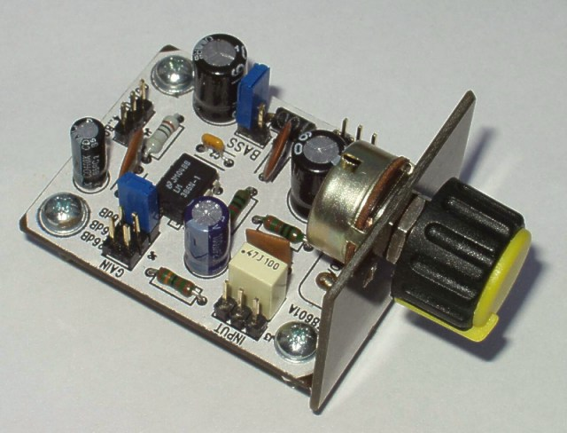

<!--- PrjInfo ---> <!--- Please remove this line after manually editing --->
<!--- 00a56be08b96043df9e37d6aff7b6990 --->
<!--- Created:2022-02-16 22:08:48.349450: ---> 
<!--- Author:: ---> 
<!--- AuthorEmail:: ---> 
<!--- Tags:: ---> 
<!--- Ust:: ---> 
<!--- Label --->
<!--- ELabel ---> 
<!--- Name:LM38601A: --->
# LM38601A
<!--- LongName --->
## Small Audio Amplifier with LM386
<!--- ELongName ---> 

<!--- Lead --->
Module of small universal audio amplifier with LM386 can be used for receivers and other devices requiring low output power. The amplifier is equipped with jumpers for setting of parameters (gain and frequency) so that it can be used more universally.
<!--- ELead ---> 

 

<!--- Description --->
<!--- EDescription --->
<!--- Content --->
<!--- EContent --->
 Generated with [MLABweb](https://github.com/MLAB-project/MLABweb). (2022-02-16)