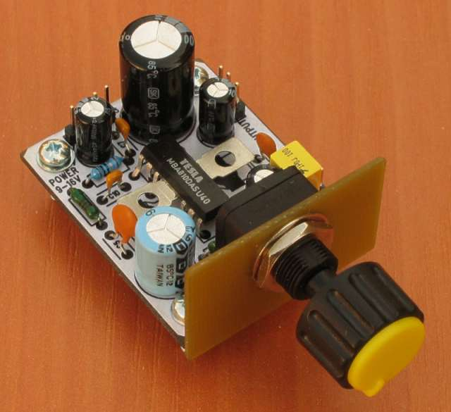

<!--- PrjInfo ---> <!--- Please remove this line after manually editing --->
<!--- 00a56be08b96043df9e37d6aff7b6990 --->
<!--- Created:2022-02-16 22:10:06.608316: ---> 
<!--- Author:: ---> 
<!--- AuthorEmail:: ---> 
<!--- Tags:: ---> 
<!--- Ust:: ---> 
<!--- Label --->
<!--- ELabel ---> 
<!--- Name:MBA81001A: --->
# MBA81001A
<!--- LongName --->
## 5W Audio Amplifier with MBA810
<!--- ELongName ---> 

<!--- Lead --->
Module of 5W audio amplifier with MBA810 (TBA810). The chip is old and it was used because we had lots of them.
<!--- ELead ---> 

 

<!--- Description --->
<!--- EDescription --->
<!--- Content --->
<!--- EContent --->
 Generated with [MLABweb](https://github.com/MLAB-project/MLABweb). (2022-02-16)