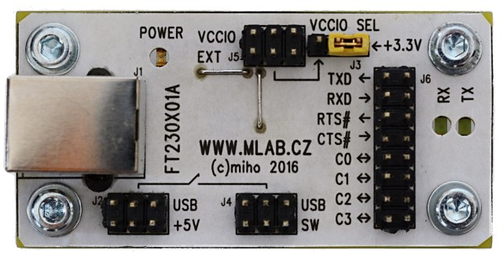

<!--- PrjInfo ---> <!--- Please remove this line after manually editing --->
<!--- 00a56be08b96043df9e37d6aff7b6990 --->
<!--- Created:2022-02-16 22:15:27.003633: ---> 
<!--- Author:: ---> 
<!--- AuthorEmail:: ---> 
<!--- Tags:: ---> 
<!--- Ust:: ---> 
<!--- Label --->
<!--- ELabel ---> 
<!--- Name:FT230X01A: --->
# FT230X01A
<!--- LongName --->
## USB to RS232 TTL converter
<!--- ELongName ---> 

<!--- Lead --->
The module allow conecting RS232 CMOS/TTL device to USB. Uses FTDI chip FT230XS. The chip is supported in all contemporary systems.
<!--- ELead ---> 

 

<!--- Description --->
<!--- EDescription --->
<!--- Content --->
<!--- EContent --->
 Generated with [MLABweb](https://github.com/MLAB-project/MLABweb). (2022-02-16)