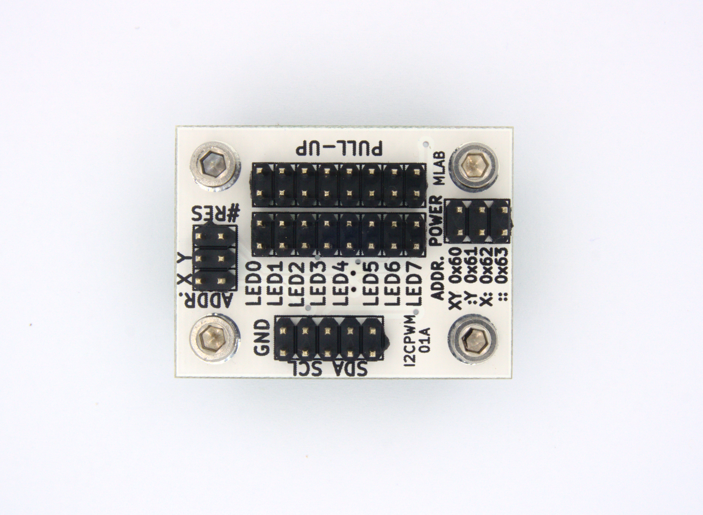

<!--- PrjInfo ---> <!--- Please remove this line after manually editing --->
<!--- 00a56be08b96043df9e37d6aff7b6990 --->
<!--- Created:2022-02-16 21:41:29.797743: ---> 
<!--- Author:: ---> 
<!--- AuthorEmail:: ---> 
<!--- Tags:: ---> 
<!--- Ust:: ---> 
<!--- Label --->
<!--- ELabel ---> 
<!--- Name:I2CPWM01A: --->
# I2CPWM01A
<!--- LongName --->
## PWM controlled I2C
<!--- ELongName ---> 

<!--- Lead --->
The module allows the generation of PWM signal, which can be adjusted using the I2C interface. The module has eight outputs that can run simultaneously on two frequencies in the range of 0.59 Hz - 152 Hz (with 1.69 - 6.58 ms).
<!--- ELead ---> 

 

<!--- Description --->
<!--- EDescription --->
<!--- Content --->
<!--- EContent --->
 Generated with [MLABweb](https://github.com/MLAB-project/MLABweb). (2022-02-16)