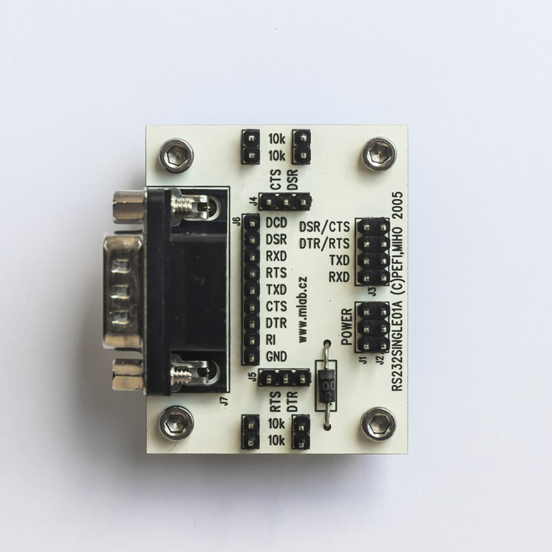

<!--- PrjInfo ---> <!--- Please remove this line after manually editing --->
<!--- 00a56be08b96043df9e37d6aff7b6990 --->
<!--- Created:2022-02-16 21:40:32.308752: ---> 
<!--- Author:: ---> 
<!--- AuthorEmail:: ---> 
<!--- Tags:: ---> 
<!--- Ust:: ---> 
<!--- Label --->
<!--- ELabel ---> 
<!--- Name:RS232SINGLE01A: --->
# RS232SINGLE01A
<!--- LongName --->
## RS232 signal converter to/from TTL
<!--- ELongName ---> 

<!--- Lead --->
The module uses well known MAX232 chip and is intended as a level converter. It uses RX/TX signals and a pair of flow control signals (selectable by jumpers). Original RS232 signals are available on header pins.
<!--- ELead ---> 

 

<!--- Description --->
<!--- EDescription --->
<!--- Content --->
<!--- EContent --->
 Generated with [MLABweb](https://github.com/MLAB-project/MLABweb). (2022-02-16)