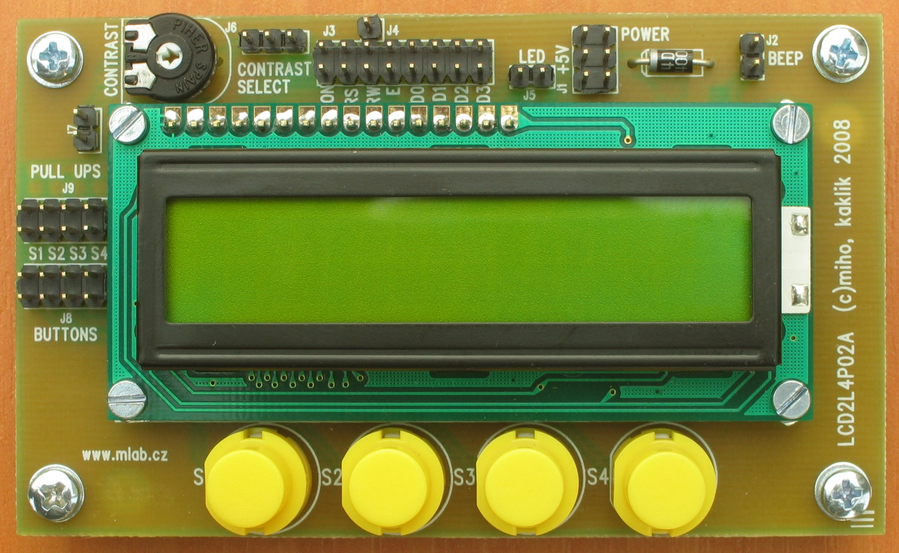

<!--- PrjInfo ---> <!--- Please remove this line after manually editing --->
<!--- 00a56be08b96043df9e37d6aff7b6990 --->
<!--- Created:2022-02-16 21:27:30.965093: ---> 
<!--- Author:: ---> 
<!--- AuthorEmail:: ---> 
<!--- Tags:: ---> 
<!--- Ust:: ---> 
<!--- Label --->
<!--- ELabel ---> 
<!--- Name:LCD2L4P02A: --->
# LCD2L4P02A
<!--- LongName --->
## Module with LCD 2 line display, 4 buttons and piezo
<!--- ELongName ---> 

<!--- Lead --->
Module with two-line LCD display (with Hitachi controller), with 4 push buttons and with piezoelement powered by 74HC04.
<!--- ELead ---> 

 

<!--- Description --->
<!--- EDescription --->
<!--- Content --->
<!--- EContent --->
 Generated with [MLABweb](https://github.com/MLAB-project/MLABweb). (2022-02-16)