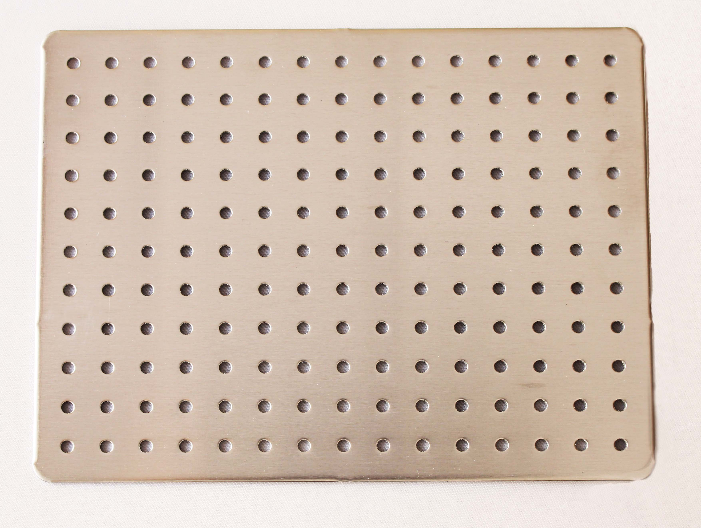

<!--- PrjInfo ---> <!--- Please remove this line after manually editing --->
<!--- 00a56be08b96043df9e37d6aff7b6990 --->
<!--- Created:2022-02-16 21:28:19.771869: ---> 
<!--- Author:: ---> 
<!--- AuthorEmail:: ---> 
<!--- Tags:: ---> 
<!--- Ust:: ---> 
<!--- Label --->
<!--- ELabel ---> 
<!--- Name:ALBASE1115: --->
# ALBASE1115
<!--- LongName --->
## Duralumin base board
<!--- ELongName ---> 

<!--- Lead --->
This base board has size 11x15 holes and standard MLAB grid 400mils (10.16mm). It is especially suited for simple measuring instruments and mobile robots constructions.
<!--- ELead ---> 

 

<!--- Description --->
<!--- EDescription --->
<!--- Content --->
<!--- EContent --->
 Generated with [MLABweb](https://github.com/MLAB-project/MLABweb). (2022-02-16)