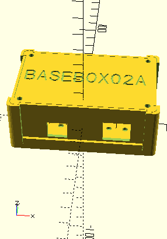

<!--- PrjInfo ---> <!--- Please remove this line after manually editing --->
<!--- 00a56be08b96043df9e37d6aff7b6990 --->
<!--- Created:2022-02-16 21:36:58.491335: ---> 
<!--- Author:: ---> 
<!--- AuthorEmail:: ---> 
<!--- Tags:: ---> 
<!--- Ust:: ---> 
<!--- Label --->
<!--- ELabel ---> 
<!--- Name:BASEBOX03A: --->
# BASEBOX03A
<!--- LongName --->
## 3D printable device housing box
<!--- ELongName ---> 

<!--- Lead --->
The printed plastic parts are sandwiched between standard hole-grid plates which makes the enclosure very rigid. The box sides can be easily customized for individual project needs, or separately exchanged during an instrument development.
<!--- ELead ---> 

 

<!--- Description --->
<!--- EDescription --->
<!--- Content --->
<!--- EContent --->
 Generated with [MLABweb](https://github.com/MLAB-project/MLABweb). (2022-02-16)