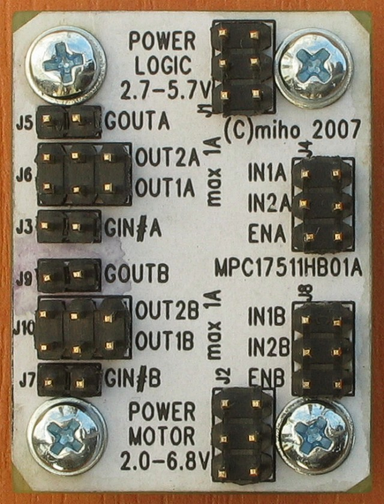

<!--- PrjInfo ---> <!--- Please remove this line after manually editing --->
<!--- 00a56be08b96043df9e37d6aff7b6990 --->
<!--- Created:2022-02-16 22:05:46.353922: ---> 
<!--- Author:: ---> 
<!--- AuthorEmail:: ---> 
<!--- Tags:: ---> 
<!--- Ust:: ---> 
<!--- Label --->
<!--- ELabel ---> 
<!--- Name:MPC17511HB01A: --->
# MPC17511HB01A
<!--- LongName --->
## H-Bridge 6.8V/1A with Freescale MC17511A
<!--- ELongName ---> 

<!--- Lead --->
The module uses two Freescale H-Bridges MC17511A. Power supply is 2.0-6.8V, current 1A, max 3A (per bridge). It is intended for driving small motors.
<!--- ELead ---> 

 

<!--- Description --->
<!--- EDescription --->
<!--- Content --->
<!--- EContent --->
 Generated with [MLABweb](https://github.com/MLAB-project/MLABweb). (2022-02-16)