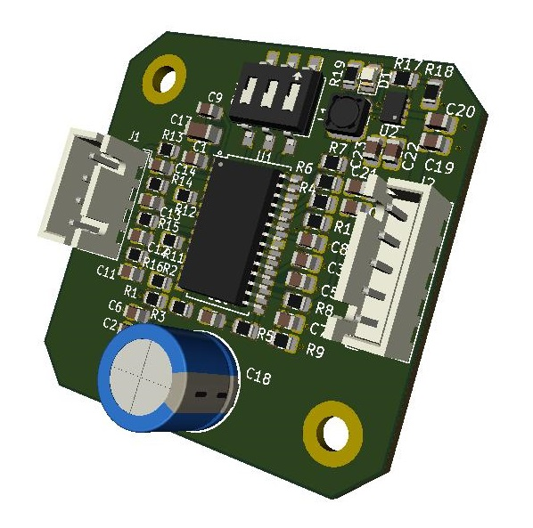

<!--- PrjInfo ---> <!--- Please remove this line after manually editing --->
<!--- 00a56be08b96043df9e37d6aff7b6990 --->
<!--- Created:Time: ---> 
<!--- Author:Mlab: ---> 
<!--- AuthorEmail:mlab@mlab.cz: ---> 
<!--- Tags:imported: ---> 
<!--- Ust:None: ---> 
<!--- Label --->
<!--- ELabel ---> 
<!--- Name:module: --->
#module 
<!--- LongName --->
module description
<!--- ELongName ---> 
Budič krokových motorů s integrovaným obvodem LV8728. Umožňuje řízení krokového motoru pomocí STEP/DIR signálů v rozmezí napětí 12 až 32V s maximálním proudem do 2A. S obvodem LV8728 lze použít mikrokrokování až 128ustep.  
<!--- Lead --->
module lead text
<!--- ELead ---> 

 

<!--- Description --->
<!--- EDescription --->
<!--- Content --->
<!--- EContent --->
