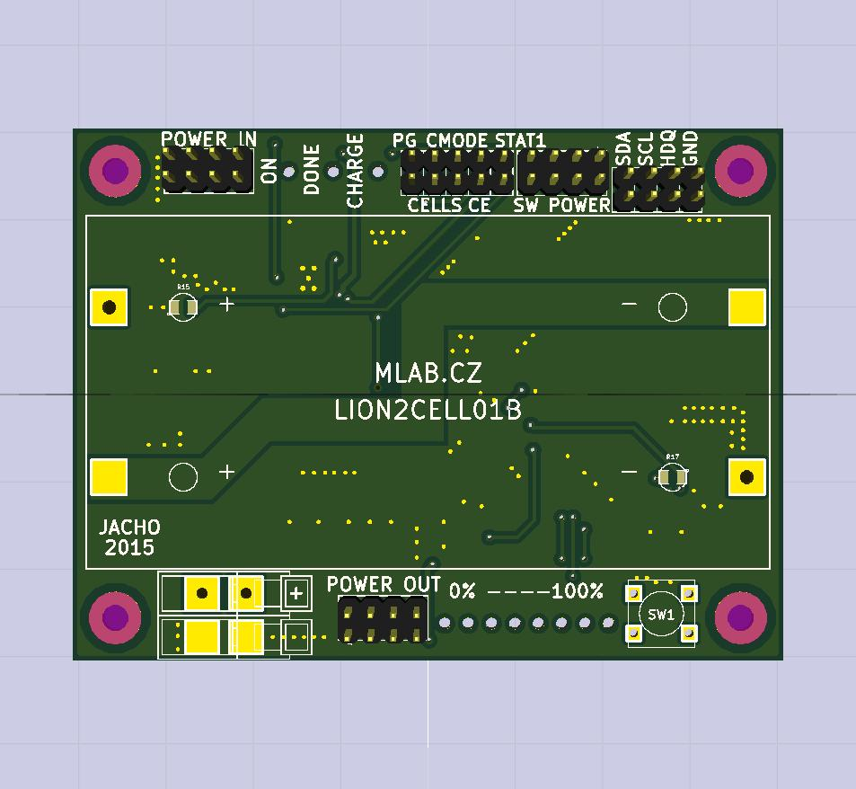

<!--- PrjInfo ---> <!--- Please remove this line after manually editing --->
<!--- 00a56be08b96043df9e37d6aff7b6990 --->
<!--- Created:2022-02-16 22:18:47.119220: ---> 
<!--- Author:: ---> 
<!--- AuthorEmail:: ---> 
<!--- Tags:: ---> 
<!--- Ust:: ---> 
<!--- Label --->
<!--- ELabel ---> 
<!--- Name:LION2CELL01C: --->
# LION2CELL01C
<!--- LongName --->
## Li-ion battery management module
<!--- ELongName ---> 

<!--- Lead --->
Integrated battery management solution for 18650 li-ion batteries. It can measure remaining energy in battery, perform charging cycle from external power source and protect batteries against over voltage or over draining conditions.
<!--- ELead ---> 

 

<!--- Description --->
<!--- EDescription --->
<!--- Content --->
<!--- EContent --->
 Generated with [MLABweb](https://github.com/MLAB-project/MLABweb). (2022-02-16)