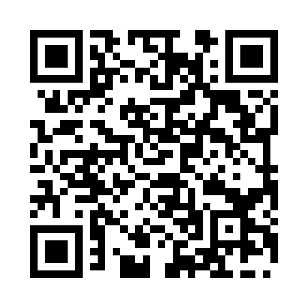

<!--- PrjInfo ---> <!--- Please remove this line after manually editing --->
<!--- 00a56be08b96043df9e37d6aff7b6990 --->
<!--- Created:2019-02-25 12:25:52.150158: ---> 
<!--- Author:: ---> 
<!--- AuthorEmail:: ---> 
<!--- Tags:: ---> 
<!--- Ust:: ---> 
<!--- Label --->
<!--- ELabel ---> 
<!--- Name:DIG4SW01A: --->
# DIG4SW01A
<!--- LongName --->
## uad-Channel Smart High-Side Switch
<!--- ELongName ---> 

<!--- Lead --->
Switch for voltage from 3.4 V to 40 V. Resistance in spliced state 160 mOhm. Integrated circuit TPS4H160.
<!--- ELead ---> 

 

<!--- Description --->
<!--- EDescription --->
<!--- Content --->
<!--- EContent --->
 Generated with [MLABweb](https://github.com/MLAB-project/MLABweb). (2019-02-25)