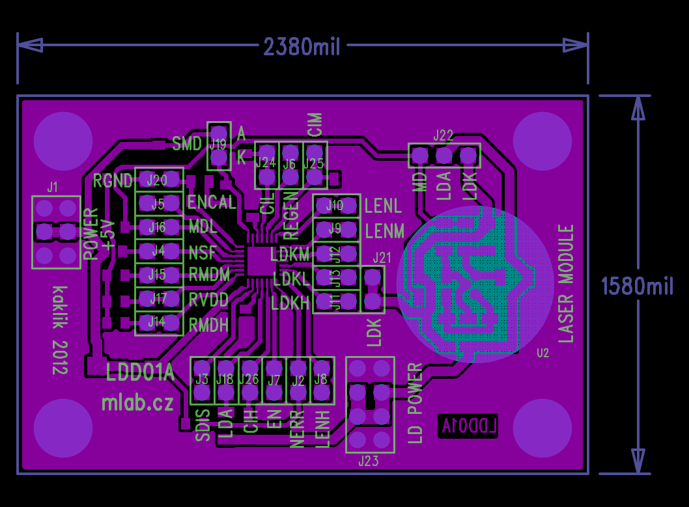

<!--- PrjInfo ---> <!--- Please remove this line after manually editing --->
<!--- 00a56be08b96043df9e37d6aff7b6990 --->
<!--- Created:2022-02-16 22:01:10.652330: ---> 
<!--- Author:: ---> 
<!--- AuthorEmail:: ---> 
<!--- Tags:: ---> 
<!--- Ust:: ---> 
<!--- Label --->
<!--- ELabel ---> 
<!--- Name:LDD01A: --->
# LDD01A
<!--- LongName --->
## Laser diode driver
<!--- ELongName ---> 

<!--- Lead --->
Three-channel laser diode pulse regulator module enables the continuous wave operation of laser diodesor spike-free switching with defined current pulsesin a frequency range of up to 155 MHz. The threechannels can be accumulatively pulsed and the peak optical power ofthe laser diode is regulated separately.
<!--- ELead ---> 

 

<!--- Description --->
<!--- EDescription --->
<!--- Content --->
<!--- EContent --->
 Generated with [MLABweb](https://github.com/MLAB-project/MLABweb). (2022-02-16)