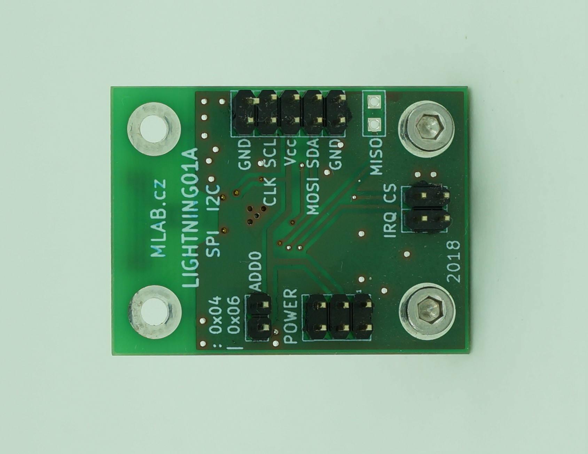

<!--- PrjInfo ---> <!--- Please remove this line after manually editing --->
<!--- 00a56be08b96043df9e37d6aff7b6990 --->
<!--- Created:2019-09-11 13:20:56.719329: ---> 
<!--- Author:: ---> 
<!--- AuthorEmail:: ---> 
<!--- Tags:: ---> 
<!--- Ust:: ---> 
<!--- Label --->
<!--- ELabel ---> 
<!--- Name:LIGHTNING01A: --->
# LIGHTNING01A
<!--- LongName --->
## Digital lightning sensor
<!--- ELongName ---> 

<!--- Lead --->
Lightning sensor module based on AS3935 Franklin Lightning Sensor IO. Sensor can be connected via I2C or SPI bus.
<!--- ELead ---> 

 

<!--- Description --->
<!--- EDescription --->
<!--- Content --->
<!--- EContent --->
 Generated with [MLABweb](https://github.com/MLAB-project/MLABweb). (2019-09-11)