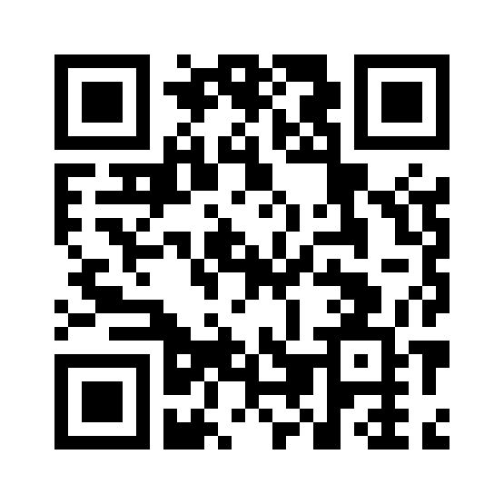

<!--- PrjInfo ---> <!--- Please remove this line after manually editing --->
<!--- 00a56be08b96043df9e37d6aff7b6990 --->
<!--- Created:2019-02-18 14:37:02.434774: ---> 
<!--- Author:: ---> 
<!--- AuthorEmail:: ---> 
<!--- Tags:: ---> 
<!--- Ust:: ---> 
<!--- Label --->
<!--- ELabel ---> 
<!--- Name:RGBC01A: --->
# RGBC01A
<!--- LongName --->
## I2C sensor colored light
<!--- ELongName ---> 

<!--- Lead --->
The sensor comprises a sensor red, green, blue and clear colors. Communication takes place via the I2C interface. Circuit includes a power supply for external IR LED. The sensor can be used to measure lighting conditions, or also for detection of the line for the bar and the robot for sensing rotation of automotive wheels.
<!--- ELead ---> 

 

<!--- Description --->
<!--- EDescription --->
<!--- Content --->
<!--- EContent --->
 Generated with [MLABweb](https://github.com/MLAB-project/MLABweb). (2019-02-18)