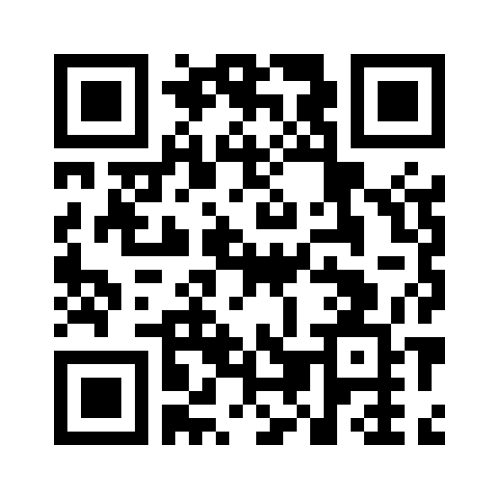

<!--- PrjInfo ---> <!--- Please remove this line after manually editing --->
<!--- 00a56be08b96043df9e37d6aff7b6990 --->
<!--- Created:2019-02-18 14:37:44.386737: ---> 
<!--- Author:: ---> 
<!--- AuthorEmail:: ---> 
<!--- Tags:: ---> 
<!--- Ust:: ---> 
<!--- Label --->
<!--- ELabel ---> 
<!--- Name:RGBHD01A: --->
# RGBHD01A
<!--- LongName --->
## RGB Feeler Head
<!--- ELongName ---> 

<!--- Lead --->
RGB Head consists of 3 pairs of Read, Green and Blue LEDs and of one fototransistor.
<!--- ELead ---> 

 

<!--- Description --->
<!--- EDescription --->
<!--- Content --->
<!--- EContent --->
 Generated with [MLABweb](https://github.com/MLAB-project/MLABweb). (2019-02-18)