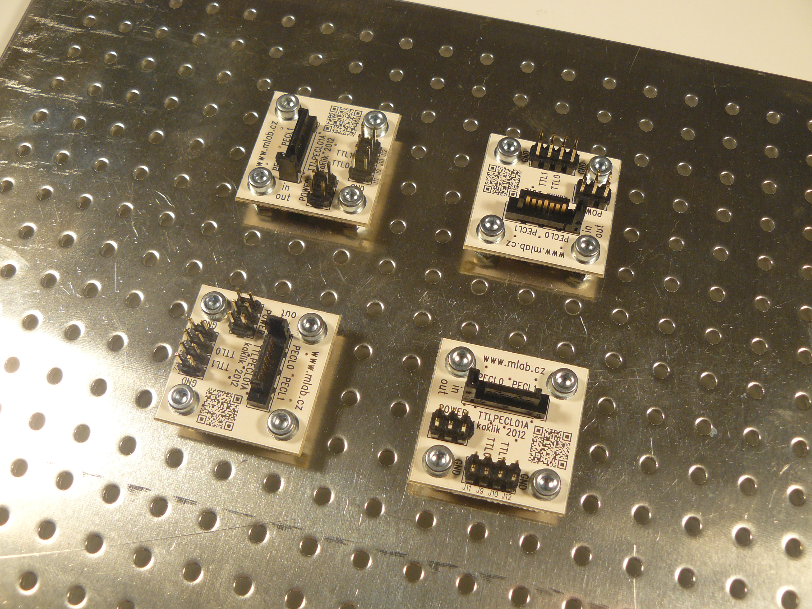

[English](./README.md)
<!--- module --->
# TTLPECL01A
<!--- Emodule --->

<!--- subtitle --->Translátor TTL na PECL a opačně <!--- Esubtitle --->

<!--- description --->Převádí logické úrovně mezi PECL a TTL. Směr převodu může být vybrán typem osazeného obvodu.<!--- Edescription --->
            