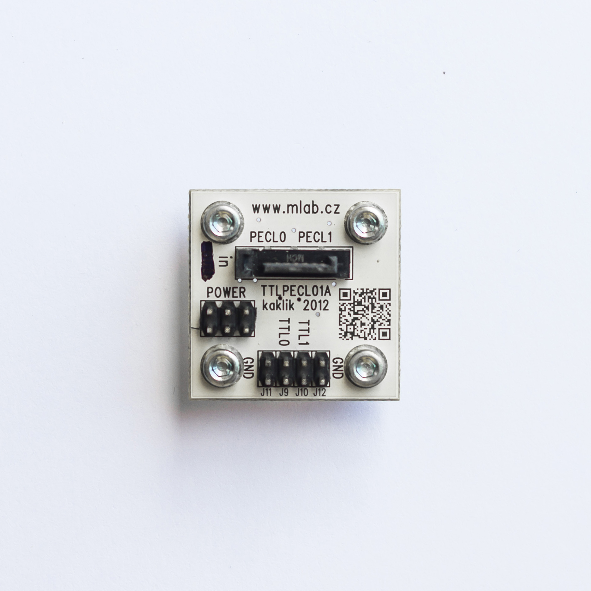

[Czech](./README.cs.md)
<!--- module --->
# TTLPECL01A
<!--- Emodule --->

<!--- subtitle --->TTL to PECL (PECL to TTL) Translator <!--- Esubtitle --->

<!--- description --->Translate between TTL a differential PECL logic levels direction of translation can be chosen by type of mounted chip. <!--- Edescription --->
            